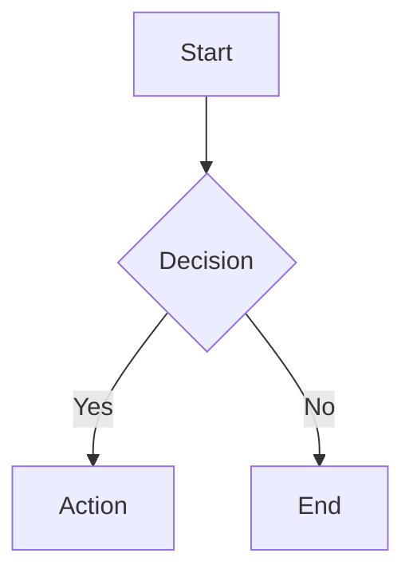
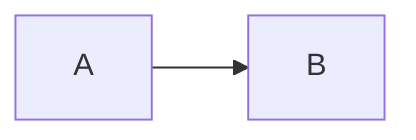

# Mermaid.js v11

## Overview

Create text-based diagrams using Mermaid.js v11 declarative syntax. Mermaid is the only diagram format that renders natively in GitHub markdown -- no exported images to commit.

## Quick Start

**Basic Diagram Structure:**

```
{diagram-type}
  {diagram-content}
```

**Common Diagram Types:**

- `flowchart` - Process flows, decision trees
- `sequenceDiagram` - Actor interactions, API flows
- `classDiagram` - OOP structures, data models
- `stateDiagram` - State machines, workflows
- `erDiagram` - Database relationships
- `gantt` - Project timelines
- `journey` - User experience flows

> WARNING: `references/diagram-types.md` covers all 24+ diagram types with full syntax. Load only when you need a specific type's syntax.

## Creating Diagrams

**Inline Markdown Code Blocks:**

````markdown

````

**Configuration via Frontmatter:**

````markdown

````

**Comments:** Use `%% ` prefix for single-line comments.

## Syntax Rules

Follow these to avoid parse errors:

- **Indentation**: Use consistent 4-space indentation
- **Node IDs**: Short unique identifiers (A, B, node1). Avoid reserved words
- **Special characters**: Wrap text with special characters in quotes
- **Subgraphs**: Must close with `end` keyword
- **Whitespace**: No trailing whitespace (causes parsing failures)
- **Complexity**: Break diagrams at 15+ elements into multiple focused diagrams

## CLI Usage

Convert `.mmd` files to images:

```bash
# Installation
npm install -g @mermaid-js/mermaid-cli

# Basic conversion
mmdc -i diagram.mmd -o diagram.svg

# With theme and background
mmdc -i input.mmd -o output.png -t dark -b transparent

# Custom styling
mmdc -i diagram.mmd --cssFile style.css -o output.svg
```

See `references/cli-usage.md` for Docker, batch processing, and advanced workflows.

## Configuration & Theming

**Common Options:**

- `theme`: "default", "dark", "forest", "neutral", "base"
- `look`: "classic", "handDrawn"
- `fontFamily`: Custom font specification
- `securityLevel`: "strict", "loose", "antiscript"

See `references/configuration.md` for complete config options, theming, and customization.

## Practical Patterns

Load `references/examples.md` for:

- Architecture diagrams
- API documentation flows
- Database schemas
- Project timelines
- State machines
- User journey maps

## Resources

- `references/diagram-types.md` - Syntax for all 24+ diagram types
- `references/configuration.md` - Config, theming, accessibility
- `references/cli-usage.md` - CLI commands and workflows
- `references/integration.md` - JavaScript API and embedding
- `references/examples.md` - Practical patterns and use cases

## See Also

- `/excalidraw` - For architecture diagrams where hand-drawn aesthetic and drag-and-drop editing matter
- `/design` - Design thinking applies to diagram composition and layout
- `/prose` - Diagram labels benefit from the same concision rules as prose
